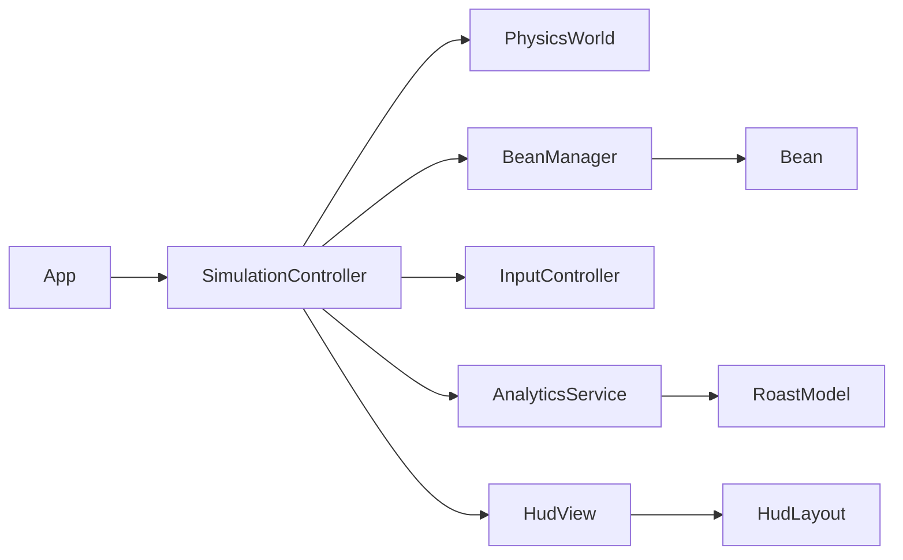

# Bean Physics

A browser-based coffee roasting sandbox where beans collide, absorb impact energy, and move through roast stages with live console-style metrics.

## Project Purpose

`Bean Physics` simulates roast progression as a playful physics system:
- spawn beans into a 2D world
- transfer energy through collisions
- map energy to roast color and temperature (C)
- track roast quality with a header HUD (time, temp, RoR, stage, distribution, curve)

## OOP Architecture

The runtime has been refactored to a class-based modular structure under `src/`.

### Main responsibilities
- `App` bootstraps all services and starts the simulation.
- `SimulationController` orchestrates game loop, forces, and interaction flow.
- `PhysicsWorld` wraps Matter.js setup/update/bounds.
- `Bean` + `BeanManager` own bean lifecycle and collision energy updates.
- `RoastModel` maps force -> progress -> temperature/stage.
- `AnalyticsService` computes aggregate metrics and histories (including RoR).
- `HudView` + `HudLayout` render and layout the roast console, charts, and HUD buttons.
- `InputController` binds mouse/touch/motion events and delegates callbacks.

## Project Structure

- `index.html` - canvas shell + script entrypoint
- `styles.css` - page and permission button styling
- `src/main.js` - module entrypoint
- `src/app/App.js` - application bootstrap
- `src/core/SimulationController.js` - orchestration loop/controller
- `src/physics/PhysicsWorld.js` - Matter.js adapter
- `src/domain/Bean.js` - bean entity
- `src/domain/BeanManager.js` - bean collection/lifecycle
- `src/roast/RoastModel.js` - roast/temperature model
- `src/analytics/AnalyticsService.js` - runtime metrics and histories
- `src/input/InputController.js` - input binding layer
- `src/ui/HudView.js` - console rendering + HUD buttons/charts
- `src/ui/HudLayout.js` - deterministic HUD geometry
- `src/config/config.js` - runtime constants and roast palette
- `src/util/color.js` - color helpers
- `src/util/time.js` - time formatting helpers
- `script.js` - legacy/inactive experiment

## Setup

No build step is required for production, and local dev can use Vite.

Ignored local artifacts are defined in `.gitignore` (for example `node_modules/` and `dist/`).

1. Clone:
   - `git clone https://github.com/naddot/bean-physics`
2. Open folder:
   - `cd bean-physics`
3. Install dependencies:
   - `npm install`
4. Run dev server:
   - `npm run dev`
5. Open:
   - `http://localhost:8000` (or the fallback Vite port shown in terminal)

### Minimal static serve alternative

- `python -m http.server 8000`
- open `http://127.0.0.1:8000`

## Runtime Dependencies

- Browser with Canvas + ES module support
- Matter.js via CDN (`index.html`)
- Optional local tool: Python 3 for static serving

## Controls

- HUD **Make bean** button:
  - click/hold to stream beans
- Canvas interaction:
  - hold mouse/touch to keep a rotating steel paddle active
  - paddle follows the pointer while held and stirs/throws beans
  - release ends the paddle interaction
- Mobile motion:
  - tilt changes gravity direction and strength (near-weightless when flat, stronger gravity when upright)
  - rapid orientation changes add extra acceleration (tilt-rate response)
  - shake applies impulse burst
  - iOS prompts permission via **Enable Motion**

## Roast Metrics (Header HUD)

- Time (since roast start)
- Batch temperature (C)
- RoR (C/min)
- Stage + consistency
- Average bean color
- Stage distribution
- Color distribution histogram
- Roast energy curve

## Configuration

Core tuning lives in `src/config/config.js`:
- `physics` - gravity, solver iterations, wall thickness
- `bean` - spawn dynamics, bounce, drag, density, roast-driven expansion/density behavior, and nearby bean energy transfer
- `mouse` - drag interaction and paddle dynamics (size, thickness, speed, scoop/throw strength)
- `motion` - tilt/shake thresholds, smoothed gravity-vs-angle mapping, and softened tilt-rate force response
- `analytics` - sample rate, history lengths, curve constants
- `temperature` - ambient/max temp and curve gamma
- `roastThresholds`, `roastColors`, `roastStages` - roast progression model
- `hud` - layout sizing
- `runtimeChecks` - lightweight invariant checks and warning throttle interval

## Runtime Checks

Lightweight unit-style runtime checks run in-browser (no test framework/build setup required):
- roast model invariants (e.g., monotonic temperature vs force)
- analytics invariants (distribution shape/sum, consistency bounds, temperature sanity, history limits)

Checks log throttled warnings to the console with `[RuntimeCheck]` prefix.

## Deployment

### GitHub Pages
1. Push to GitHub
2. Enable Pages from branch root
3. Use generated site URL

### Google Cloud Storage Static Hosting
1. Create bucket in project `bqsqltesting`
2. Upload `index.html`, `styles.css`, and `src/` files
3. Configure website entrypoint to `index.html`
4. Grant `Storage Object Viewer` to `allUsers` for public hosting

Required API:
- Cloud Storage API

Required IAM:
- `roles/storage.admin` for deployer

## Known Limitations

- Session data is in-memory only (no persistence)
- Very high bean counts reduce FPS
- Mobile sensor behavior varies by browser/device
- Roast stages and transfer rates are stylized approximations, not a calibrated roasting model

## Troubleshooting

- Blank page: verify Matter.js CDN loaded successfully
- Motion not working on iOS: press **Enable Motion** and grant permission
- Stale output: hard refresh (`Ctrl+F5`)

